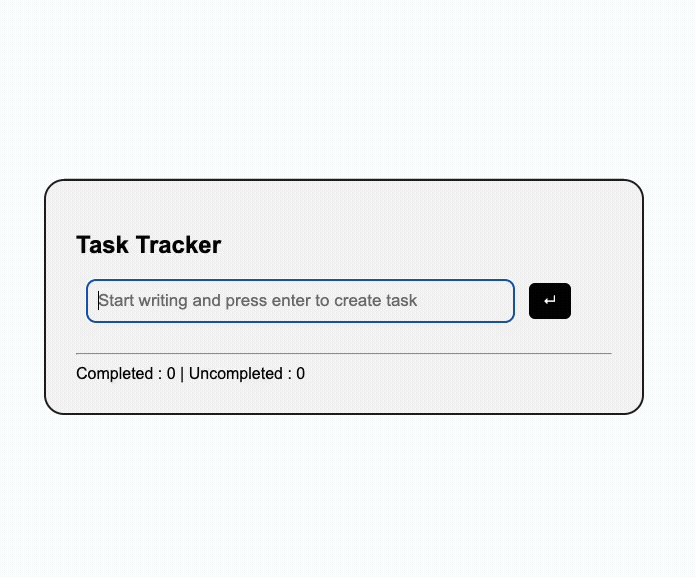

# Task Manager Application

A simple **Task Manager web application** built to practice full-stack development concepts including frontend development, backend APIs, file-based data storage, and containerization using Docker.

The application allows users to:

- Add new tasks
- Mark tasks as completed
- Delete tasks
- View completed and uncompleted tasks separately

This project demonstrates **frontend–backend integration using APIs** and **persistent data storage using a JSON file**.

---
## Project Demo



---

# Tech Stack

<details>
<summary><strong>View Technologies Used</strong></summary>

### Frontend
- HTML
- CSS
- JavaScript

### Backend
- Node.js
- Express.js

### Data Storage
- JSON file (`output.json`)

### Containerization
- Docker

</details>

---

# Features

<details>
<summary><strong>View Application Features</strong></summary>

### Task Management
- Add new tasks
- Delete tasks
- Mark tasks as completed or uncompleted
- Show uncompleted tasks at the top
- Move completed tasks to the bottom
- Display counters for completed and pending tasks

### Backend API
- RESTful API implementation
- CRUD operations for tasks
- Modular backend architecture

### Frontend Integration
- Uses `fetch` API to communicate with backend
- Dynamically renders tasks in the UI
- Updates task list without refreshing the page

### Data Persistence
- Tasks stored inside a JSON file
- File operations handled using a utility module

### Docker Integration
- Application containerized using Docker
- Docker image created for Node.js server
- Container runs the application in an isolated environment
- Volume mapping used to persist JSON data

</details>

---

# Application Architecture

<details>
<summary><strong>View Architecture Flow</strong></summary>

```
User
 │
 ▼
Frontend (HTML + CSS + JS)
 │
 ▼
Fetch API Requests
 │
 ▼
Express Server
 │
 ▼
Routes
 │
 ▼
Controllers
 │
 ▼
Services
 │
 ▼
File Handler Utility
 │
 ▼
JSON Database (output.json)
```

</details>

---

# Data Flow

<details>
<summary><strong>Create Task Flow</strong></summary>

1. User enters a task in the input field.
2. Frontend sends a **POST request** using `fetch`.
3. Express route receives the request.
4. Controller processes the request.
5. Service layer updates the task list.
6. File handler writes updated data to `output.json`.
7. Server sends a response.
8. Frontend updates the UI.

</details>

<details>
<summary><strong>Update Task Flow</strong></summary>

1. User toggles the checkbox.
2. Frontend sends a **PUT request**.
3. Backend updates the task completion status.
4. Updated data is written to the JSON file.
5. UI reorders tasks based on completion status.

</details>

<details>
<summary><strong>Delete Task Flow</strong></summary>

1. User clicks the delete button.
2. Frontend sends a **DELETE request**.
3. Backend removes the task from JSON data.
4. Updated data is saved to the file.
5. Task is removed from the UI.

</details>

---

# Project Structure

<details>
<summary><strong>View Folder Structure</strong></summary>

```
Task_Manager
│
├── data
│   └── output.json
│
├── node_modules
│
├── public
│   ├── index.html
│   ├── index.js
│   └── style.css
│
├── src
│   │
│   ├── controllers
│   │   └── dataController.js
│   │
│   ├── routes
│   │   └── dataRoutes.js
│   │
│   ├── services
│   │   └── dataService.js
│   │
│   └── utils
│       └── fileHandler.js
│
├── app.js
├── server.js
├── package.json
├── package-lock.json
├── Dockerfile
├── .dockerignore
├── .gitignore
└── README.md
```

</details>

---

# API Endpoints

<details>
<summary><strong>View API Routes</strong></summary>

| Method | Endpoint | Description |
|------|------|------|
| GET | `/api/tasks` | Retrieve all tasks |
| POST | `/api/task` | Create a new task |
| PUT | `/api/task/:id` | Update task completion status |
| DELETE | `/api/task/:id` | Delete a task |

</details>

---

# Running the Project

<details>
<summary><strong>Run Locally</strong></summary>

Install dependencies

```
npm install
```

Start the server

```
node server.js
```

Open in browser

```
http://localhost:4000
```

</details>

---

# Running with Docker

<details>
<summary><strong>Docker Commands</strong></summary>

Build Docker image

```
docker build -t task-tracker .
```

Run Docker container

```
docker run -p 4000:4000 -v $(pwd)/data:/app/data task-tracker
```

</details>

---

# Learning Outcomes

<details>
<summary><strong>Concepts Practiced</strong></summary>

- Git and GitLab workflow
- Frontend development with JavaScript
- Backend API development with Express
- Layered backend architecture (Routes → Controllers → Services)
- File-based data storage using JSON
- Error handling using middleware
- Frontend–backend communication using Fetch API
- Containerizing Node.js applications using Docker
- Using Docker volumes for persistent storage

</details>